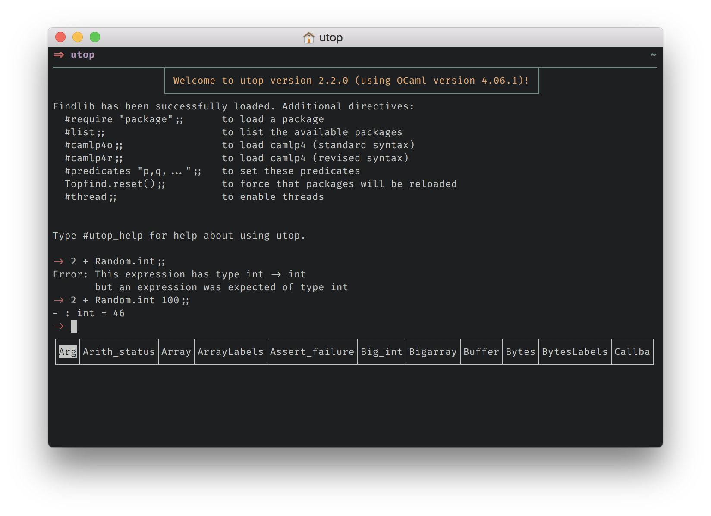

[](https://ci.ocamllabs.io/github/ocaml-community/utop)

utop — a universal toplevel (i.e., REPL) for OCaml
==================================================

utop is an improved toplevel (i.e., Read-Eval-Print Loop) for
OCaml. It can run in a terminal or
in Emacs. It supports line editing, history, real-time and context
sensitive completion, colors, and more.

It integrates with the Tuareg, caml, ReasonML and typerex modes in Emacs.



Installation via opam
---------------------

The easiest and recommended way of installing utop is via
[opam](https://opam.ocaml.org/):

    opam install utop

If you want to build it manually, refer to the opam file which lists the
dependencies.

Installation from sources
-------------------------

To build and install utop:

    make
    make install

### Documentation and manual pages _(optional)_

To build the documentation (currently broken):

    make doc

It will then be installed by `make install`.

### Tests _(optional)_

To build and execute tests (currently broken):

    make test

Usage
-----

To use utop, simply run:

    utop

utop displays a bar after the prompt which is used to show possible
completions in real time. You can navigate in it using `M-left` and
`M-right`, and select one completion using `M-down`. The `M` denotes
the meta key, which is `Alt` on most systems.

Customization
-------------

### Colors

To add colors to utop, copy one of the files `utoprc-dark` or
`utoprc-light` to `~/.config/utop/utoprc`. `utoprc-dark` is for terminals with
dark colors (such as white on black) and `utoprc-light` is for
terminals with light colors (such as black on white).

### Prompt

You can customize the prompt of utop by setting the reference
`UTop.prompt`.

To turn off all colors and remove the line above the prompt
that lists time, etc., add this to ~/.config/utop/init.ml:
```OCaml
#utop_prompt_dummy;;
```
To turn off the line of boxes listing possible completions that appears under
the prompt, add this to ~/.config/utop/init.ml:
```OCaml
UTop.set_show_box false
```

### Key bindings

Key bindings in the terminal can be changed by writing a
`~/.config/lambda-term-inputrc` file. For example:

    [read-line]
    C-left: complete-bar-prev
    C-right: complete-bar-next
    C-down: complete-bar

If manual pages are correctly installed you can see a description of
this file by executing:

    $ man 5 lambda-term-inputrc

### Vi edit mode

You can turn on the vi edit mode by `#edit_mode_vi`. It currently supports
three vi modes: normal, insert, visual mode, and you can get/set content
with vim-like registers.

This special edit mode is evolving rapidly; see the CHANGES of lambda-term for the rapidly changing information.

### UTop API

UTop exposes several more settings through its API; see
[documentation](http://ocaml-community.github.io/utop).

Integration with Emacs
----------------------

### Overview

`utop.el` is a package that provides `utop` integration with Emacs.
The package allows you to run `utop` inside Emacs and to evaluate
code in it straight from your source buffers (with the help of `utop-minor-mode`).

Those features are covered in more details in the ["Usage"](#usage-emacs) section.

### Requirements

`utop.el` requires Emacs 26.1 or newer. You'll also have to install
`utop` and make sure it's on Emacs's `exec-path`, so that it could be
started from within Emacs.

### Main setup

The recommended way to install `utop.el` is via Emacs's built-in package manager `package.el`.

`utop.el` is available on the community-maintained
[MELPA Stable](https://stable.melpa.org) and [MELPA](https://melpa.org) `package.el` repositories.
If you're not using them already, please follow the setup instructions
[here](https://melpa.org/#/getting-started).

**Note:** Using MELPA Stable is recommended as it has the latest stable version.
MELPA has a development snapshot for users who don't mind breakage but
don't want to run `utop.el` from a git checkout.

Once you've enabled MELPA (Stable), you can install `utop.el` using the following command:

<kbd>M-x package-install [RET] utop [RET]</kbd>

or if you'd rather keep it in your Emacs config:

```emacs-lisp
(unless (package-installed-p 'utop)
  (package-refresh-contents)
  (package-install 'utop))
```

`use-package` users can do something like this:

```emacs-lisp
(use-package utop
  :ensure t)
```

If the installation doesn't work try refreshing the package list:

<kbd>M-x package-refresh-contents</kbd>

Alternatively, if you have installed utop via opam, you can add this
to your `~/.emacs`:

```elisp
;; Add the opam lisp dir to the Emacs load path
(add-to-list
 'load-path
 (replace-regexp-in-string
  "\n" "/share/emacs/site-lisp"
  (shell-command-to-string "opam var prefix")))

;; Automatically load utop.el
(autoload 'utop "utop" "Toplevel for OCaml" t)
```

In any case, if you installed utop via opam you should add this to
your `~/.emacs`:

```elisp
;; Use the opam installed utop
(setq utop-command "opam exec -- utop -emacs")
```

If you use `dune` and want to launch `dune utop` in emacs, you
should add this to your `~/.emacs`:

```elisp
(setq utop-command "opam exec -- dune utop . -- -emacs")
```

This was tested with opam 2.1. For older versions of opam, you can
copy&paste this to your `~/.emacs`:

```elisp
;; Setup environment variables using opam
(dolist (var (car (read-from-string (shell-command-to-string "opam config env --sexp"))))
  (setenv (car var) (cadr var)))

;; Update the Emacs path
(setq exec-path (append (parse-colon-path (getenv "PATH"))
                        (list exec-directory)))

;; Update the Emacs load path
(add-to-list 'load-path (expand-file-name "../../share/emacs/site-lisp"
                                          (getenv "OCAML_TOPLEVEL_PATH")))

;; Automatically load utop.el
(autoload 'utop "utop" "Toplevel for OCaml" t)
```

### Usage
<a href="emacs-usage"></a>

You can start utop inside Emacs with: `M-x utop`.

`utop.el` also ships with a minor mode that has the following key-bindings:

| key-binding | function            | Description                  |
|-------------|---------------------|------------------------------|
| C-c C-s     | utop                | Start a utop buffer          |
| C-x C-e     | utop-eval-phrase    | Evaluate the current phrase  |
| C-x C-r     | utop-eval-region    | Evaluate the selected region |
| C-c C-b     | utop-eval-buffer    | Evaluate the current buffer  |
| C-c C-k     | utop-kill           | Kill a running utop process  |
| C-c C-z     | utop-switch-to-repl | Switch to utop process       |

You can enable the minor mode using `M-x utop-minor-mode`, or you can
have it enabled by default with the following configuration:

```elisp
(autoload 'utop-minor-mode "utop" "Minor mode for utop" t)
(add-hook 'tuareg-mode-hook 'utop-minor-mode)
```

If you plan to use utop with another major-mode than tuareg, replace
`tuareg-mode-hook` by the appropriate hook. The utop minor mode will work out of
the box with these modes: `tuareg-mode`, `caml-mode`, `reason-mode` and
`typerex-mode`. For other modes you will need to set the following three
variables:

- `utop-skip-blank-and-comments`
- `utop-skip-to-end-of-phrase`
- `utop-discover-phrase`

You can also complete text in a buffer using the environment of the
toplevel. For that bind the function `utop-edit-complete` to the key
you want.

Common error
------------

If you get this error when running utop in a terminal or in Emacs this
means that the environment variable `CAML_LD_LIBRARY_PATH` is not set
correctly:

    Fatal error: cannot load shared library dlllwt-unix_stubs
    Reason: dlopen(dlllwt-unix_stubs.so, 138): image not found

It should point to the directory `stublibs` inside your ocaml installation.

Automatically installing toplevel printers
------------------------------------------

Utop will automatically install toplevel printers for custom
types if their interface files are marked with an
`[@@ocaml.toplevel_printer]` attribute.  Adding this annotation to
your libraries will remove the need to have a separate `top` package
to install the printers.

For example, in the [uri](https://github.com/mirage/ocaml-uri)
library, the old printing function for `Uri.t` was:

```
val pp_hum : Format.formatter -> t -> unit
```

Just adding this annotation results in `Uri.t` values being automatically
pretty printed in this version of utop.

```
val pp_hum : Format.formatter -> t -> unit [@@ocaml.toplevel_printer]
```

There should be no downsides to adding this attribute to your
libraries, so we encourage community library maintainers to
use this attribute to improve the out-of-the-box experience
for users of their libraries within utop.

Creating a custom utop-enabled toplevel
---------------------------------------

### With Dune

The recommended way to build a custom utop toplevel is via
[Dune][dune]. The entry point of the custom utop must call
`UTop_main.main`. For instance, write the following `myutop.ml` file:

```ocaml
let () = UTop_main.main ()
```

and the following dune file:

```elisp
(executable
 (name myutop)
 (link_flags -linkall)
 (libraries utop))
```

then, to build the toplevel, run:

```
$ dune myutop.bc
```

Note the `-linkall` in the link flags. By default OCaml doesn't link
unused modules. However for a toplevel you don't know in advance what
the user is going to use so you must link everything.

If you want to include more libraries in your custom utop, simply add
them to the `(libraries ...)` field.

Additionally, if you want to install this toplevel, add the two
following fields to the executable stanza:

```elisp
  (public_name myutop)
  (modes byte)
```

The `(modes ...)` field is to tell dune to install the byte-code
version of the executable, as currently native toplevels are not fully
supported.

[dune]: https://github.com/ocaml/dune

### Manually, with ocamlfind

This section describe methods using `ocamlfind`. These are no longer
tested, so there is no guarantee they still work.

If you want to create a custom toplevel with utop instead of the
classic one you need to link it with utop and its dependencies and
call `UTop_main.main` in the last linked unit. You also need to pass
the `-thread` switch when linking the toplevel.

The easiest way to do that is by using `ocamlfind`:

    $ ocamlfind ocamlmktop -o myutop -thread -linkpkg -package utop myutop_main.cmo

Where `myutop_main.ml` contains:

```ocaml
let () = UTop_main.main ()
```

You can also use the `ocamlc` sub-command instead of `ocamlmktop`. In
this case you need to pass these three extra arguments:

* `-linkall` to be sure all units are linked into the produced toplevel
* `-package compiler-libs.toplevel`
* `-predicates create_toploop`

With the last option `ocamlfind` will generate a small ocaml unit,
linked just before `myutop_main.cmo`, which will register at startup
packages already linked in the toplevel so they are not loaded again
by the `#require` directive. It does the same with the `ocamlmktop`
sub-command.

For example:

    $ ocamlfind ocamlc -o myutop -thread -linkpkg -linkall -predicates create_toploop \
        -package compiler-libs.toplevel,utop myutop.cmo

Note that if you are not using `ocamlfind`, you will need to do that
yourself. You have to call `Topfind.don't_load` with the list of all
packages linked with the toplevel.

A full example using `ocamlbuild` is provided in the
[examples/custom-utop](examples/custom-utop) directory.
